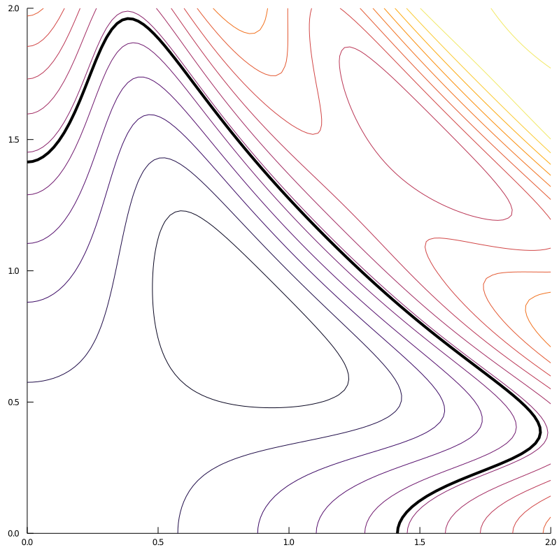
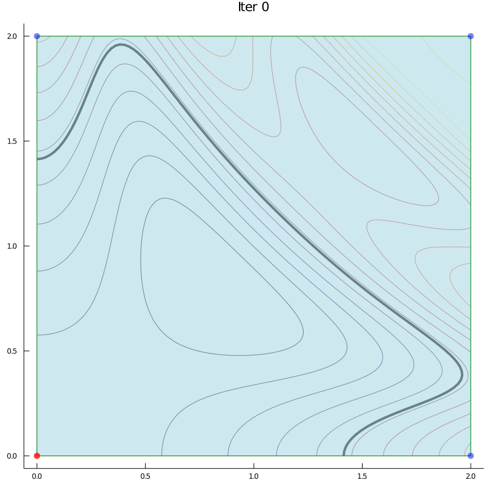
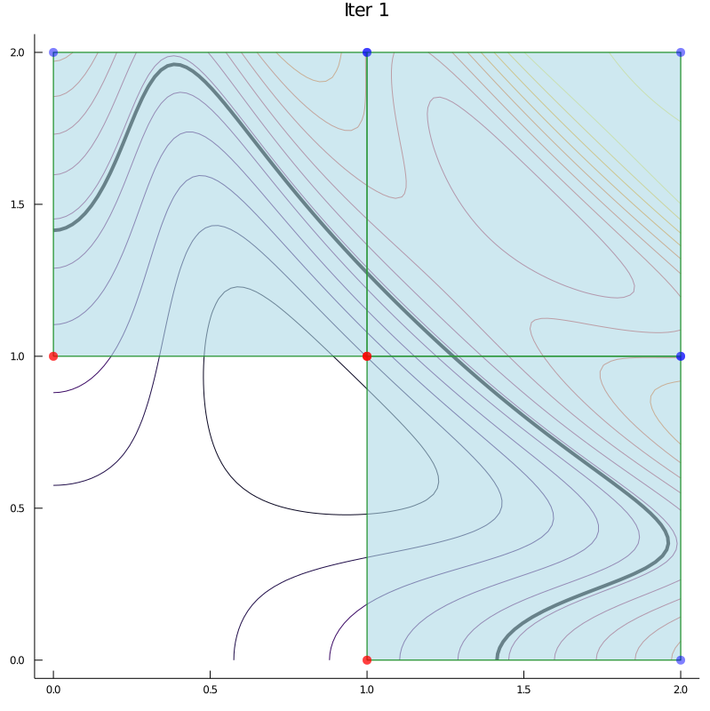
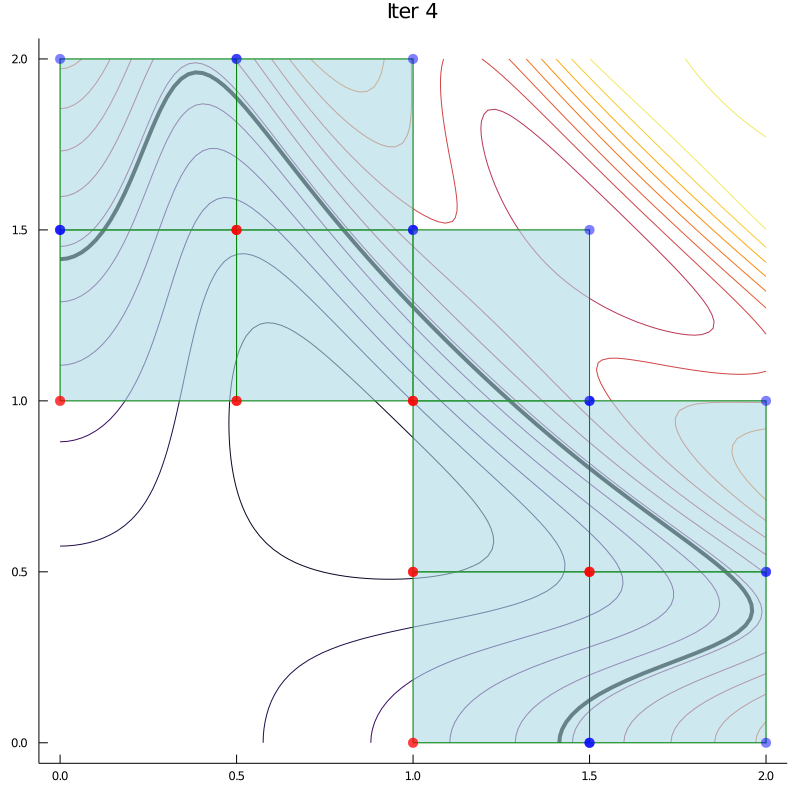
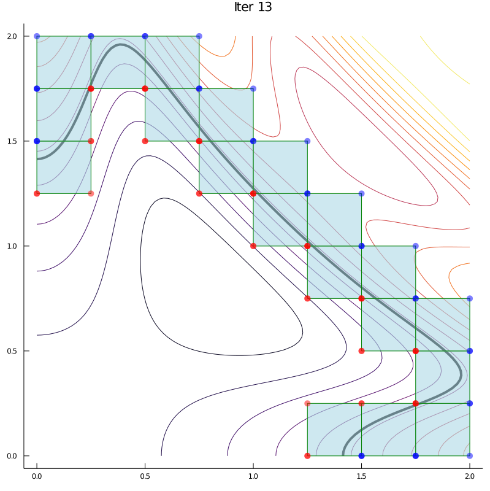
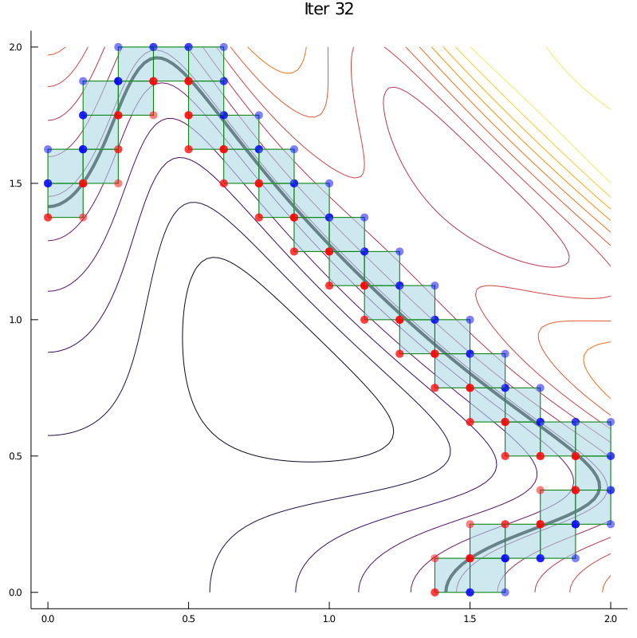
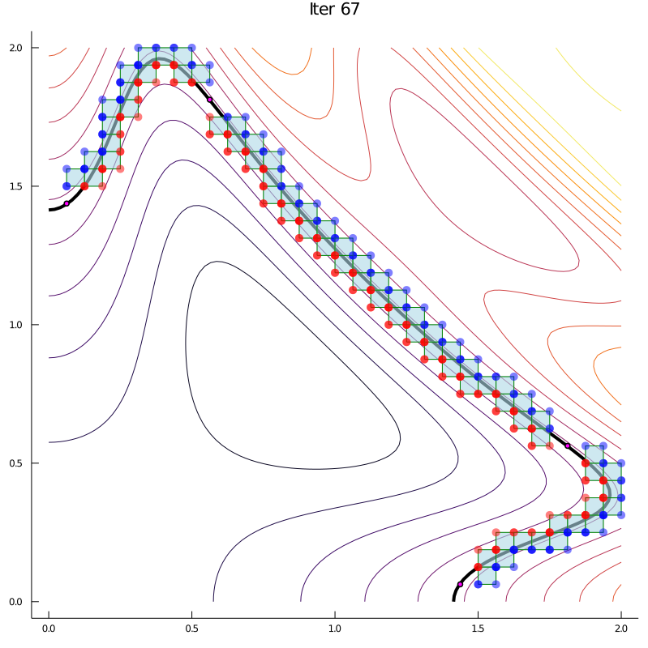
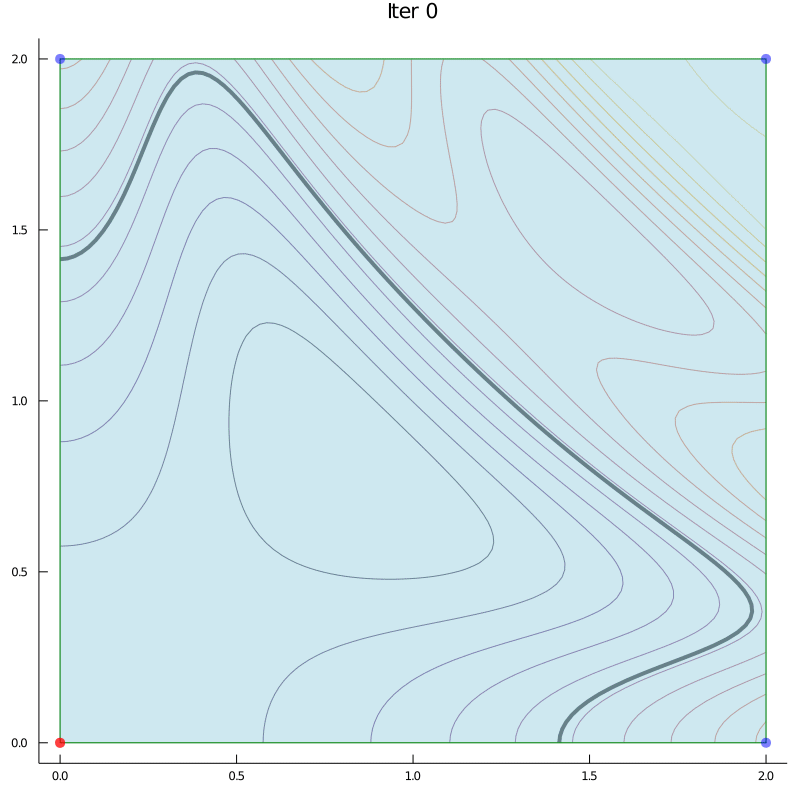
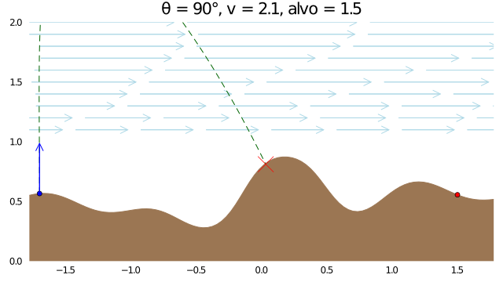

# Bissecurva

O seu objetivo neste exercício é encontrar várias soluções da equação

    f(x,y) = 0,

isto é, uma equação não linear com duas variáveis.
É esperado que existam várias soluções para esse problema, embora não seja
garantido.

O método que usaremos é o que denominaremos bissecurva - que não é o nome oficial!
Este método é uma simplificação de uma ideia mais geral, normalmente chamada de bissecção multivariada.

## Método

Primeiro, iremos considerar um exemplo visual.
Abaixo estão as curvas de nível de uma certa função, e numa curva mais grossa, a curva de nível correspondente à f(x,y) = 0.

A ideia do método é começar com um retângulo `[a,b]x[c,d]` tal que seu extremos tenham valores de função com sinais diferentes (ou pelo menos um zero). Isso garante que existe um zero dentro do conjunto para funções contínuas. Nas imagens abaixo os extremos vermelhos são negativos e os em azul são positivos.

Esse retângulo é dividido pelas medianas dos lados gerando 4 novos retângulos. Destes, os que tiverem apenas valores positivos ou apenas valores negativos nos extremos, são removidos. O resto é adicionado à uma fila para serem analisados.
A situação depois dessa primeira divisão está abaixo:

Por construção, cada retângulo que sobrou satisfaz a hipótese inicial.
Sendo assim, podemos repetir o processo para cada retângulo da lista.
Depois de repetir o processo mais 3 vezes, isto é, para cada novo retângulo, temos a situação abaixo:

Note que no primeiro retângulo que fizemos, obtivemos 3 retângulos válidos.
Desta vez, tivemos 4 retângulos novos para o 1° e o 3° retângulo, e apenas 1 retângulo novo para o 2° retângulo, ou seja, cada retângulo é um problema em si.
A divisão é repetida até que o `|f(x,y)| < eps`, ou até que o tamanho do retângulo seja muito pequeno.
Em ambos os casos, definimos o ponto médio como uma aproximação para o zero da função.
Note que na teoria estaremos excluindo alguns pontos do conjunto de soluções, mas é o que tem pra hoje.

Abaixo temos mais 3 exemplos em momentos distintos, e no fim uma animação.
Nos exemplos abaixo, os pontos em magenta são as soluções aproximadas encontradas.
Utilizamos `eps = 1e-2` nas imagens.

## Canhão

Você vai usar o seu algoritmo para resolver um problema aplicado, onde um canhão numa posição fixa tenta acertar um alvo em outra posição.
Você deve decidir a inclinação e a velocidade inicial do tiro.
Um código já pronto faz a simulação do tiro, levando em conta a gravidade e um vento que carrega o projétil.
A posição horizontal do alvo será um dos parâmetros de entrada.
Exemplos:

Você implementar duas funções dentro do arquivo [canhao.jl](canhao.jl).
Uma para usar bissecurva para calcular diversas soluções, e outra para escolher uma das soluções de acordo com um objetivo e retornar essa solução.